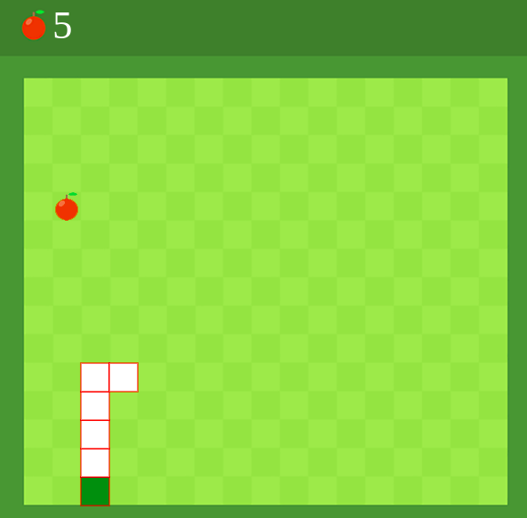

# Snake Game 
- Link of the project: https://kevschmidt.github.io/snake-game/
- Clone the repository: ``` git clone git@github.com:kevSchmidt/snake-game.git ```

### Tools:
<h1>

</h1>

### Preview:



### How does it works?

- To be able to create our game, we have to make use of HTML canvas. 
This is what is used to draw graphics using JavaScript.

- To make our canvas visible, we draw a 32 boxes.
This covers the entire canvas, starting from the top left corner (0, 0).

- To display the snake on the canvas, we can represent the snake as an array of coordinates.
We add a new head to the snake using unshift() and remove the last element of snake using pop().

- We want to make the snake appear to be moving forward step by step. To do that, we use setTimeout.
  
